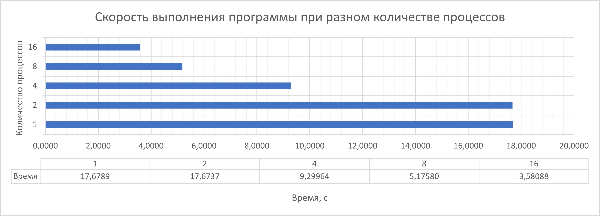
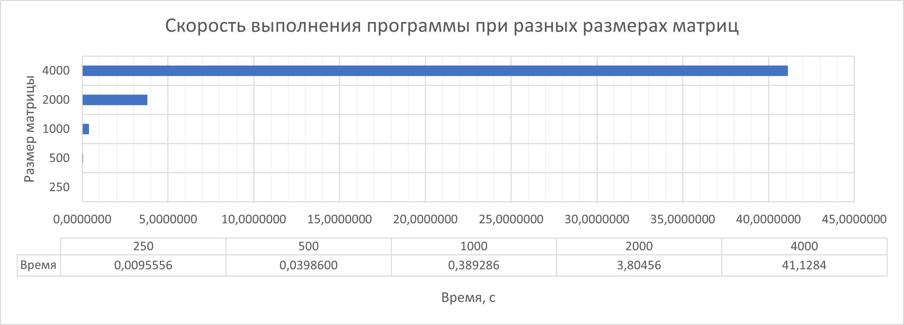

# Отчёт по заданию с использованием MPI

## Информация о программе

Программа осуществляет умножение квадратных матриц размером N*N (для 5 вариантов, где N = 250, 500, 1000. 2000, 4000) при помощи библиотеки параллельного программирования MPI. Программа написана с использованием языка программирования C++.

## Руководство по работе с программой

1. Скомпилировать программу любым удобным способом (в зависимости от ОС и использующихся средств);
2. Запустить программу при помощи консольной операции (в зависимости от ОС и использующихся средств)
> Вариант для запуска в ОС Windows после сборки проекта в Visual Studio:
>> mpiexec -n processNumber .\MPI_Matrix.exe (где processNumber — число необходимых процессов для работы программы)
3. Дождаться окончания работы программы и получить результат.

## Технические характеристики

* Процессор: Intel Core i5-13400
* ОЗУ: 32 Гб DDR5
* ОС: Windows 11 23H2
* ПО для запуска: Microsoft Visual Studio 2022, версия 17.8.1

## Результаты исследования 

* Исследование зависимости скорости работы программы от количества процессов

    Для исследования запуски производились для квадратных матриц размером 2000*2000. В качестве времени работы бралось среднее значение 5 запусков для каждого количества процессов

     

* Исследование зависимости скорости работы программы от размера матриц

    Для исследования запуски производились для 16 процессов. В качестве времени работы бралось среднее значение 5 запусков для различных размеров

    

## Информация об обучающемся
* ФИО: Завьялов Олег Валерьевич
* Группа: ИТ-12МО