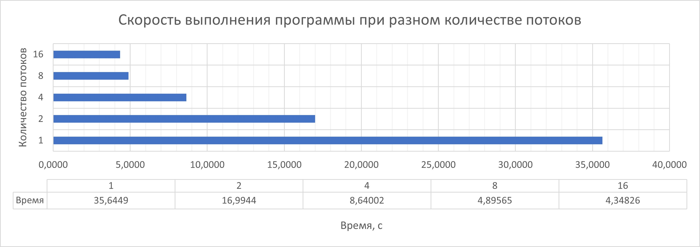
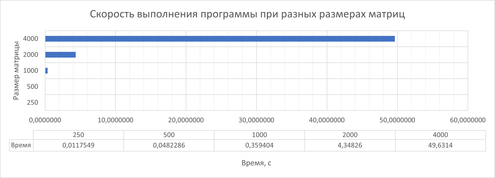

# Отчёт по заданию с использованием OpenMP

## Информация о программе

Программа осуществляет умножение квадратных матриц размером N*N при помощи библиотеки параллельного программирования OpenMP. Программа написана с использованием языка программирования C++.

## Руководство по работе с программой

1. Запустить программу любым удобным способом (в зависимости от ОС и использующихся средств);
2. Ввести необходимое для работы программы количество потоков (соответствующая информация будет выведена при запуске программы);
3. Ввести размеры квадратных матриц, используемых для вычислений;
4. Дождаться окончания работы программы и получить результат.

## Технические характеристики

* Процессор: Intel Core i5-13400
* ОЗУ: 32 Гб DDR5
* ОС: Windows 11 22H2
* ПО для запуска: Microsoft Visual Studio 2022, версия 17.8.1

## Результаты исследования 

* Исследование зависимости скорости работы программы от количества потоков

    Для исследования запуски производились для квадратных матриц размером 2000*2000. В качестве времени работы бралось среднее значение 5 запусков для каждого потока

     

* Исследование зависимости скорости работы программы от размера матриц

    Для исследования запуски производились для 16 потоков. В качестве времени работы бралось среднее значение 5 запусков для различных размеров

    

## Информация об обучающемся
* ФИО: Завьялов Олег Валерьевич
* Группа: ИТ-12МО